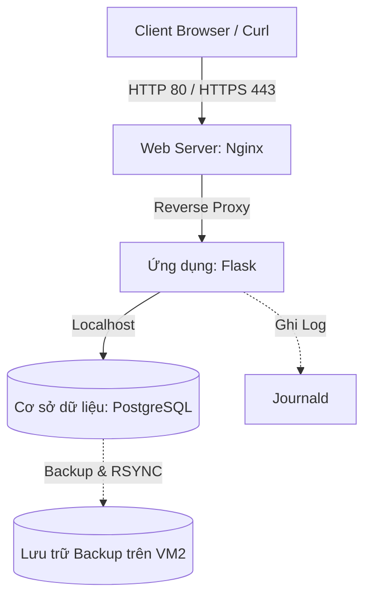

# Đồ Án Cuối Kỳ - Hệ Điều Hành Linux & Ứng Dụng

**Nhóm:** ``
**Môn học:** Hệ điều hành Linux & Ứng dụng
**Khoa:** Công nghệ Thông tin - Trường ĐH Khoa học Tự nhiên, ĐHQG-HCM

---

## 1. Hướng đồ án đã chọn

Hệ thống được xây dựng và triển khai dựa trên các công nghệ sau:
- **Hệ điều hành:** `Ubuntu 22.04`
- **Web Server (Reverse Proxy):** `Nginx`
- **Ứng dụng:** `Flask`
- **Cơ sở dữ liệu:** `PostgreSQL`
- **Tường lửa:** `UFW`
- **Mạng:**
- **Cấu hình VM:** 2 CPU, 4GB RAM
- **Cấu hình nâng cao:** `TLS`
- **Kênh nhận thông báo:** `Mail, Telegram`
---

## 2. Bảng phân công thành viên

| STT | Họ và Tên | MSSV | Vai trò & Phân công công việc |
|:---:|:---|:---|:---|
| 1 | `Nguyễn Văn Tuấn` | `[MSSV]` | Hạ tầng & Mạng |
| 2 | `Lê Thành Vinh` | `[MSSV]` | Reverse Proxy & Bảo mật Web |
| 3 | `Mai Thị Kim Duyên` | `[MSSV]` | Ứng dụng & Systemd |
| 4 | `Nguyễn Ngọc Hưng Phát` | `[MSSV]` | CSDL & Sao Lưu |
| 5 | `Nguyễn Nam Việt` | `[MSSV]` | Tự động hóa & Cảnh báo |

---

## 3. Sơ đồ kiến trúc máy ảo (VM)

Hệ thống được chia thành 2 máy ảo chính (Mạng: `[Host-Only / Internal]`):

- **VM1 (Main Server - IP: `[IP của VM1]`):** Chạy Web Server (Reverse Proxy), Ứng dụng chính (chạy qua systemd), và Cơ sở dữ liệu (chỉ listen trên localhost).
- **VM2 (Backup/Bastion - IP: `[IP của VM2]`):** Nhận bản sao lưu đồng bộ định kỳ từ VM1 thông qua rsync. Được dùng làm điểm nhảy mạng (Bastion host) nếu cần.

---

## 4. Cách tái tạo hệ thống (Reproduction)

Để cấu hình và khởi chạy hệ thống này từ đầu trên một máy ảo mới, vui lòng thực hiện các bước sau:

1. **Chuẩn bị môi trường:** 
   - Khởi tạo 2 máy ảo `Ubuntu 22.04` với cấu hình tối thiểu 2 vCPU, 4GB RAM.
   - Cấp quyền `sudo` cho tài khoản người dùng và thiết lập khóa SSH giữa các máy ảo.

2. **Khôi phục cấu hình Dịch vụ:**
   - Cài đặt các package cần thiết: `[nginx]`, `[postgresql]`, `[fail2ban]`, `[auditd]`, `[jq]`.
   - Sao chép các tệp cấu hình trong thư mục nộp bài vào đúng vị trí tương ứng trên máy ảo (như chỉ định trong Báo cáo). Tạo file .env dựa trên mẫu .env.example.
   - Dùng lệnh `pip install -r requirements.txt` để cài đặt các thư viện Python.

3. **Chạy ứng dụng:**
   - Đặt file `flaskapp.service` vào `/etc/systemd/system/`.
   - Chạy lệnh `sudo systemctl daemon-reload` và `sudo systemctl enable --now flaskapp.service`.

4. **Khởi chạy bộ công cụ Bash Script:**
   