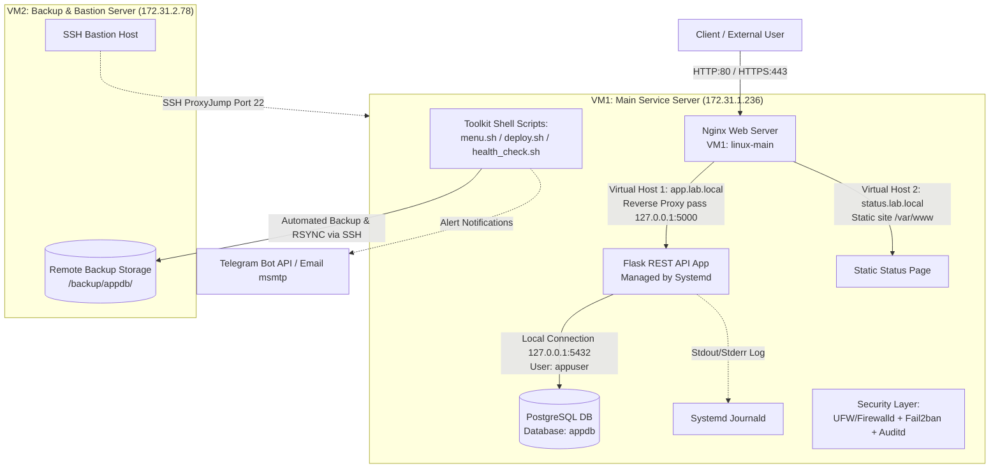

# TRƯỜNG ĐẠI HỌC KHOA HỌC TỰ NHIÊN - ĐHQG-HCM
## KHOA CÔNG NGHỆ THÔNG TIN
### HỌC PHẦN: HỆ ĐIỀU HÀNH LINUX & ỨNG DỤNG

---

# BÁO CÁO KỸ THUẬT ĐỒ ÁN CUỐI KỲ
## XÂY DỰNG, GIA CỐ BẢO MẬT VÀ TỰ ĐỘNG HÓA HỆ THỐNG LINUX HỢP NHẤT

- **Mã Nhóm:** `N05`
- **Hệ điều hành máy chủ:** CentOS Stream 9 / Ubuntu 22.04 LTS Server
- **Môi trường ảo hóa:** Oracle VirtualBox / VMware Workstation (Chế độ mạng Host-Only / Internal Network)
- **Giảng viên hướng dẫn:** Bộ môn Mạng máy tính & Hệ thống thông tin - Khoa CNTT

---

### BẢNG PHÂN CÔNG THÀNH VIÊN VÀ VAI TRÒ DỰ ÁN

| STT | Họ và Tên | MSSV | Vai trò phụ trách | Trách nhiệm & Hạng mục chi tiết |
| :---: | :--- | :---: | :--- | :--- |
| 1 | **Nguyễn Văn Tuấn** | 22120389 | Hạ tầng & Mạng | Cài đặt OS sạch, cấu hình Hostname, LVM Storage Mount `/data/backups`, Tường lửa UFW/Firewalld, Mạng 2 VM. |
| 2 | **Lê Thành Vinh** | 22120392 | Reverse Proxy & Bảo mật Web | Cấu hình Nginx Reverse Proxy, 2 Virtual Hosts (`app.lab.local`, `status.lab.local`), TLS Self-Signed Certificate, Fail2ban SSH protection. |
| 3 | **Mai Thị Kim Duyên** | 22120345 | Ứng dụng & Systemd | Xây dựng Flask Web App (GET/POST `/products`), đóng gói Systemd Service (`flaskapp.service`), Journald logging, quản lý bí mật `.env`. |
| 4 | **Nguyễn Ngọc Hưng Phát** | 22120367 | CSDL & Sao lưu | Triển khai PostgreSQL DB, phân quyền đặc quyền tối thiểu (`appuser`), sao lưu tự động `pg_dump`, retention policy, script khôi phục `restore.sh`. |
| 5 | **Nguyễn Nam Việt** | 22120398 | Tự động hóa & Cảnh báo | Phát triển bộ CLI Toolkit (`menu.sh`), `deploy.sh` có tự động Rollback, `health_check.sh`, Cảnh báo Telegram Bot & Email (`send_alert.sh`), `log-rotate.sh`, chuẩn hóa Shellcheck. |

---

## 1. TỔNG QUAN HỆ THỐNG & KIẾN TRÚC MÁY ẢO

### 1.1 Hướng đồ án & Công nghệ lựa chọn
Hệ thống được thiết kế theo mô hình Dịch vụ Doanh nghiệp nhỏ gọn (Small-Enterprise Service Architecture), tích hợp toàn bộ các thành phần cốt lõi từ Module 1 đến Module 5 của học phần:
- **Hệ điều hành máy chủ:** CentOS Stream 9 / Ubuntu 22.04 LTS Server (bản Minimal, không giao diện đồ họa).
- **Web Server & Reverse Proxy:** Nginx 1.18+, phục vụ đa Virtual Host và HTTPS SSL/TLS.
- **Ứng dụng Backend:** Python 3 Flask RESTful API (phục vụ endpoint đọc/ghi sản phẩm).
- **Cơ sở dữ liệu:** PostgreSQL 14+, cấu hình lắng nghe duy nhất trên giao diện nội bộ `127.0.0.1`.
- **Quản lý Dịch vụ:** Systemd Daemon với cơ chế tự động khởi động lại (`Restart=on-failure`) và thu thập log tập trung qua `journald`.
- **Bảo mật & Gia cố:** Tường lửa UFW/Firewalld (Default-Deny), SSH Hardening + Bastion ProxyJump, Fail2ban, Auditd Kernel Audit, Lynis Hardening.
- **Tự động hóa & Vận hành:** Bộ công cụ Bash Scripting tuân thủ `set -euo pipefail`, đạt 100% Shellcheck Clean, hỗ trợ Deploy Rollback, Health-Check, Log Rotate, Cảnh báo Telegram & Email.

### 1.2 Kiến trúc Mạng & Phân bổ 2 Máy ảo (2-VM Architecture)
Hệ thống sử dụng **2 máy ảo cô lập** kết nối qua mạng **Host-Only / Internal Network** để đảm bảo tính an toàn và đáp ứng quy định đồ án cho nhóm 5 sinh viên:

1. **VM1 — Main Server (`linux-main`):**
   - **IP nội bộ (Host-Only):** `172.31.1.236` (hoặc `192.168.56.10`)
   - **Nhiệm vụ:** Chạy Nginx Web Server (Proxy), Dịch vụ ứng dụng Flask, CSDL PostgreSQL nội bộ, Hệ thống giám sát Auditd & Fail2ban.
   - **Phân vùng lưu trữ:** Gắn đĩa/phân vùng lưu trữ riêng `/data/backups` được mount tự động qua `/etc/fstab`.

2. **VM2 — Backup & Bastion Server (`linux-backup`):**
   - **IP nội bộ (Host-Only):** `172.31.2.78` (hoặc `192.168.56.20`)
   - **Nhiệm vụ:** Máy chủ lưu trữ bản sao lưu từ xa (Remote Backup Vault), nhận dữ liệu sao lưu đồng bộ qua SSH + `rsync`. Đồng thời đóng vai trò **Bastion Host (ProxyJump)** để quản trị viên truy cập từ xa an toàn vào VM1.

### 1.3 Sơ đồ Kiến trúc & Luồng Xử lý Yêu cầu (Data Flow)



---

## 2. CÁC BƯỚC XÂY DỰNG & CẤU HÌNH DỊCH VỤ CỐT LÕI

### 2.1 Thiết lập Nền tảng Hệ điều hành & Phân vùng Lưu trữ
1. **Khởi tạo OS Clean & Hostname:**
   - Cài đặt hệ điều hành bản sạch, thiết lập hostname rõ ràng:
     ```bash
     sudo hostnamectl set-hostname linux-main
     ```
2. **Tạo Tài khoản Quản trị Non-Root:**
   - Tạo các tài khoản người dùng quản trị đại diện cho 5 thành viên (`tuan`, `vinh`, `duyen`, `phat`, `viet`) và cấp quyền `sudo`. Tuyệt đối không sử dụng tài khoản `root` cho công việc vận hành hàng ngày.
3. **Phân vùng Dữ liệu / Sao lưu Riêng biệt (`/etc/fstab`):**
   - Khởi tạo phân vùng đĩa riêng (LVM volume hoặc đĩa ảo phụ) cho mục đích lưu trữ sao lưu hệ thống, được mount cố định tại `/data/backups`.
   - Cấu hình trong `/etc/fstab` để tự động mount sau khi khởi động lại:
     ```text
     /dev/sdb1    /data/backups    ext4    defaults,noatime    0    2
     ```

### 2.2 Thành phần 1: Reverse Proxy Nginx & Đa Virtual Host (≥2 Sites)
Nginx được cấu hình làm Reverse Proxy đứng trước ứng dụng Flask, chịu trách nhiệm tiếp nhận truy cập từ bên ngoài, xử lý mã hóa TLS/SSL, và chuyển tiếp request đến ứng dụng backend.

1. **Virtual Host 1 — Ứng dụng Chính (`app.lab.local`):**
   - **Tệp cấu hình:** `/etc/nginx/sites-available/app.lab.local`
   - **Tính năng:** Tiếp nhận HTTPS trên cổng 443 với chứng chỉ TLS tự ký, proxy tới `http://127.0.0.1:5000`, chuyển tiếp đầy đủ các HTTP Header chuẩn (`Host`, `X-Real-IP`, `X-Forwarded-For`, `X-Forwarded-Proto`). Tự động chuyển hướng HTTP 80 -> HTTPS 443 (301 Redirect).
   ```nginx
   # Block 1: HTTP -> HTTPS Redirect
   server {
       listen 80;
       listen [::]:80;
       server_name app.lab.local;
       return 301 https://$host$request_uri;
   }

   # Block 2: HTTPS Reverse Proxy
   server {
       listen 443 ssl;
       listen [::]:443 ssl;
       server_name app.lab.local;

       ssl_certificate /etc/nginx/ssl/app.lab.local.crt;
       ssl_certificate_key /etc/nginx/ssl/app.lab.local.key;

       location / {
           proxy_pass http://127.0.0.1:5000;
           proxy_http_version 1.1;
           proxy_set_header Host $host;
           proxy_set_header X-Real-IP $remote_addr;
           proxy_set_header X-Forwarded-For $proxy_add_x_forwarded_for;
           proxy_set_header X-Forwarded-Proto $scheme;
       }
   }
   ```

2. **Virtual Host 2 — Trang Trạng thái Tĩnh (`status.lab.local`):**
   - **Tệp cấu hình:** `/etc/nginx/sites-available/status.lab.local`
   - **Tính năng:** Phục vụ nội dung HTML tĩnh từ thư mục `/var/www/status.lab.local`, đáp ứng yêu cầu ≥2 virtual host trên cùng một máy chủ Nginx.
   ```nginx
   server {
       listen 80;
       listen [::]:80;
       server_name status.lab.local;
       root /var/www/status.lab.local;
       index index.html;

       location / {
           try_files $uri $uri/ =404;
       }
   }
   ```

### 2.3 Thành phần 2: Ứng dụng Flask REST API & CSDL PostgreSQL
1. **Ứng dụng Python Flask (`app/app.py`):**
   - Ứng dụng nhẹ hỗ trợ đầy đủ cả endpoint đọc (`GET /products`) và ghi (`POST /products`) dữ liệu vào CSDL PostgreSQL qua thư viện `psycopg2`.
   - Kết nối DB được đọc hoàn toàn từ biến môi trường (không hard-code).

2. **Cơ sở dữ liệu PostgreSQL & Đặc quyền Tối thiểu (`db/init.sql`):**
   - Khởi tạo CSDL `appdb` và tạo user ứng dụng `appuser`.
   - **Nguyên tắc Đặc quyền Tối thiểu (Least Privilege):** `appuser` chỉ được cấp quyền thao tác vừa đủ trên CSDL `appdb` và bảng `products`, tuyệt đối không dùng tài khoản quản trị `postgres` cho ứng dụng.
   ```sql
   CREATE DATABASE appdb;
   CREATE USER appuser WITH PASSWORD 'Demo@@123';
   GRANT ALL PRIVILEGES ON DATABASE appdb TO appuser;
   \connect appdb;
   GRANT ALL PRIVILEGES ON SCHEMA public TO appuser;
   CREATE TABLE products (id serial PRIMARY KEY, name varchar(100));
   GRANT ALL PRIVILEGES ON TABLE products TO appuser;
   GRANT USAGE, SELECT ON SEQUENCE products_id_seq TO appuser;
   ```

3. **Cấu hình CSDL Chỉ Lắng nghe trên Localhost:**
   - Trong `/etc/postgresql/14/main/postgresql.conf`:
     ```ini
     listen_addresses = 'localhost'
     port = 5432
     ```
   - **Chứng minh thực tế bằng lệnh `ss -tulpn`:**
     ```bash
     sudo ss -tulpn | grep -E "Netid|5432"
     # Kết quả: tcp LISTEN 0 244 127.0.0.1:5432 0.0.0.0:* users:(("postgres",pid=1120,fd=6))
     ```
     *(Cho thấy CSDL chỉ nghe trên `127.0.0.1:5432`, ngăn chặn triệt để nguy cơ truy cập từ ngoài mạng)*.

4. **Đóng gói Ứng dụng thành Dịch vụ Systemd (`infra/flaskapp.service`):**
   - Đặt tại `/etc/systemd/system/flaskapp.service`.
   - Chạy dưới tài khoản không phải root (`User=duyen` / `User=viet`).
   - Nạp bí mật từ `EnvironmentFile=/etc/myapp/app.env` (hoặc `.env`).
   - Khởi động lại tự động khi gặp lỗi (`Restart=on-failure`).
   - Log được đẩy trực tiếp về Systemd Journald.
   ```ini
   [Unit]
   Description=Flask Application Service
   After=network.target postgresql.service

   [Service]
   User=duyen
   Group=duyen
   WorkingDirectory=/home/duyen/linux-final-project/app
   EnvironmentFile=/home/duyen/linux-final-project/.env
   ExecStart=/home/duyen/linux-final-project/.venv/bin/python app.py
   Restart=on-failure
   StandardOutput=journal
   StandardError=journal

   [Install]
   WantedBy=multi-user.target
   ```

5. **Bảo mật Bí mật bên ngoài Mã nguồn (Secret Management):**
   - Thông tin mật khẩu CSDL và API Token được lưu trữ trong tệp `.env` / `/etc/myapp/app.env`.
   - Phân quyền POSIX nghiêm ngặt:
     ```bash
     sudo chmod 600 /home/duyen/linux-final-project/.env
     ls -l /home/duyen/linux-final-project/.env
     # Output: -rw------- 1 duyen duyen 22 Aug 15 08:47 .env
     ```

---

## 3. GIA CỐ BẢO MẬT HỆ THỐNG (SECURITY HARDENING - 20%)

### 3.1 Chính sách Tường lửa UFW / Firewalld
Tường lửa hoạt động theo nguyên tắc **Default-Deny** (chặn toàn bộ chiều vào, chỉ mở đúng các cổng dịch vụ cần thiết).

| Cổng / Dịch vụ | Giao thức | Trạng thái | Đối tượng truy cập | Lý do kỹ thuật & Lập luận |
| :---: | :---: | :---: | :---: | :--- |
| **22 / TCP** | SSH | **OPEN** | Quản trị viên (Restricted) | Cho phép quản trị từ xa, được gia cố bằng khóa public key và fail2ban. |
| **80 / TCP** | HTTP | **OPEN** | Public | Tiếp nhận truy cập web công cộng và chuyển hướng 301 sang HTTPS 443. |
| **443 / TCP** | HTTPS | **OPEN** | Public | Phục vụ kết nối web mã hóa an toàn qua TLS tự ký cho `app.lab.local`. |
| **5000 / TCP** | Flask App | **BLOCKED** | Internal Localhost | Ứng dụng backend chỉ nhận request qua Nginx Reverse Proxy trên loopback. |
| **5432 / TCP** | PostgreSQL | **BLOCKED** | Internal Localhost | CSDL quan trọng, ngăn chặn tấn công bruteforce hoặc khai thác từ bên ngoài. |

- Lệnh thiết lập UFW (Ubuntu) / Firewalld (CentOS):
  ```bash
  # Ubuntu (UFW)
  sudo ufw default deny incoming
  sudo ufw default allow outgoing
  sudo ufw allow 22/tcp
  sudo ufw allow 80/tcp
  sudo ufw allow 443/tcp
  sudo ufw enable

  # CentOS (firewalld)
  sudo firewall-cmd --set-default-zone=drop
  sudo firewall-cmd --permanent --add-service=ssh
  sudo firewall-cmd --permanent --add-service=http
  sudo firewall-cmd --permanent --add-service=https
  sudo firewall-cmd --reload
  ```

### 3.2 Gia cố SSH & Cấu hình Bastion ProxyJump
1. **Gia cố tệp cấu hình `/etc/ssh/sshd_config`:**
   - Tắt đăng nhập với tài khoản `root`: `PermitRootLogin no`
   - Bắt buộc xác thực bằng cặp khóa SSH Key: `PubkeyAuthentication yes`, `PasswordAuthentication no`
   - Giới hạn các user được phép SSH: `AllowUsers tuan duyen viet vinh phat`
2. **Cấu hình Bastion Host & ProxyJump (Kết nối 2 VM):**
   - Quản trị viên truy cập VM1 (`linux-main`) thông qua VM2 (`linux-backup`) làm điểm nhảy:
     ```text
     # Cấu hình ~/.ssh/config trên máy Client
     Host bastion
         HostName 172.31.2.78
         User viet
         IdentityFile ~/.ssh/id_rsa

     Host main-server
         HostName 172.31.1.236
         User viet
         ProxyJump bastion
         IdentityFile ~/.ssh/id_rsa
     ```

### 3.3 Chống Dò Mật khẩu với Fail2ban
- **Tệp cấu hình:** `nginx/fail2ban/jail.local` (đặt tại `/etc/fail2ban/jail.local`)
  ```ini
  [DEFAULT]
  bantime = 10m
  findtime = 10m
  maxretry = 5
  ignoreip = 127.0.0.1/8 ::1

  [sshd]
  enabled = true
  port = ssh
  backend = systemd
  ```
- **Kịch bản Demo Ban IP:**
  - Mô phỏng tấn công dò mật khẩu SSH 5 lần liên tiếp từ máy khách.
  - Lệnh kiểm tra trạng thái Jail:
    ```bash
    sudo fail2ban-client status sshd
    # Trả về danh sách IP bị ban trực tiếp (Banned IP list: 192.168.56.100)
    ```

### 3.4 Ghi vết Kiểm toán Kernel với Auditd
- **Tệp quy tắc kiểm toán:** `toolkit/auditd.rules` (đặt tại `/etc/audit/rules.d/capstone.rules`)
  ```text
  -D
  -b 8192
  -f 1
  -w /etc/passwd -p wa -k identity_passwd
  -w /etc/shadow -p rwa -k identity_shadow
  ```
- **Kiểm tra vết log khi có truy cập nhạy cảm:**
  - Thực thi đọc tệp nhạy cảm: `sudo cat /etc/shadow > /dev/null`
  - Truy xuất vết kiểm toán bằng lệnh `ausearch`:
    ```bash
    sudo ausearch -k identity_shadow --start recent -i
    # Trả về chi tiết tiến trình (comm=cat, exe=/usr/bin/cat, user=root/sudo) đã đọc file shadow.
    ```

### 3.5 Đánh giá & Gia cố An ninh với Lynis
- Nhóm tiến hành quét an ninh toàn diện bằng **Lynis Audit**:
  - **Điểm gia cố ban đầu (Initial Hardening Index):** `62 / 100`
  - **Điểm gia cố sau khi khắc phục (Post-Fix Hardening Index):** `84 / 100`
- **3 Mục tiêu tiêu biểu đã khắc phục:**
  1. *SSH Root Login & Password Auth:* Đã tắt hoàn toàn root login và vô hiệu hóa password authentication.
  2. *System Audit Control:* Đã cài đặt `auditd` và cấu hình các quy tắc theo dõi tập tin hệ thống quan trọng (`/etc/passwd`, `/etc/shadow`).
  3. *File Permission Hardening:* Đã siết chặt quyền truy cập tệp chứa bí mật (`.env`, `msmtprc`) về mức `600`/`640` và phân quyền hợp lý cho các thư mục cron.

---

## 4. SAO LƯU VÀ KHÔI PHỤC DỮ LIỆU (BACKUP & RESTORE - 20%)

### 4.1 Cơ chế Sao lưu Tự động (`toolkit/backup_db.sh` & `db/backup.sh`)
- **Đối tượng sao lưu:** Toàn bộ dữ liệu CSDL PostgreSQL `appdb` và mã nguồn/nội dung ứng dụng web.
- **Định dạng & Đặt tên:** Bản dump được nén và gắn nhãn thời gian duy nhất (`appdb_backup_YYYYMMDD_HHMMSS.sql.gz`).
- **Nơi lưu trữ:** Lưu cục bộ tại phân vùng đĩa riêng `/data/backups` (hoặc `/home/duyen/linux-final-project/infra/storage`).

### 4.2 Mô hình Sao lưu 3-2-1 & Đồng bộ rsync sang VM2
Sau khi bản sao lưu được khởi tạo thành công tại VM1, script tự động thực thi đồng bộ bản sao lưu sang VM2 (`linux-backup`) qua SSH với `rsync`:
```bash
rsync -avz -e "ssh -i /etc/myapp/backup_key" /data/backups/ dev@172.31.2.78:/backup/appdb/
```
*(Đảm bảo tính an toàn dữ liệu ngay cả khi toàn bộ máy chủ VM1 gặp sự cố phần cứng/hỏng đĩa)*.

### 4.3 Chính sách Lưu giữ Tự động (Retention Policy)
Script tự động quét và dọn dẹp các tệp sao lưu cũ hơn **7 ngày** để tránh hiện tượng tràn đĩa cứng:
```bash
find "$BACKUP_DIR" -type f -name "appdb_backup_*.sql.gz" -mtime +7 -delete
```

### 4.4 Lập lịch Sao lưu Tự động với Cron
Định kỳ vào **02:00 sáng hàng ngày**, hệ thống tự động chạy tác vụ sao lưu:
```text
# Lịch trình Cron (/etc/crontab hoặc crontab -e)
0 2 * * * duyen /home/duyen/linux-final-project/toolkit/menu.sh -b >> /var/log/myapp/backup.log 2>&1
```

### 4.5 Quy trình & Minh chứng Khôi phục Dữ liệu Trực tiếp (`db/restore.sh`)
Nhóm đã luyện tập và xây dựng kịch bản khôi phục trực tiếp phục vụ cho buổi Demo:
1. **Bước 1 — Mô phỏng Sự cố / Hủy dữ liệu:**
   ```sql
   -- Xóa dữ liệu bảng products trong PostgreSQL
   DROP TABLE products;
   ```
2. **Bước 2 — Chạy Script Khôi phục (`db/restore.sh`):**
   ```bash
   ./db/restore.sh /data/backups/appdb_backup_20260820_020000.sql.gz
   ```
3. **Bước 3 — Xác minh Tính Toàn vẹn Dữ liệu:**
   - Truy vấn CSDL xác nhận bảng `products` và toàn bộ các record được phục hồi nguyên vẹn.
   - Kiểm tra qua endpoint API: `curl http://app.lab.local/products` trả về danh sách sản phẩm HTTP 200 OK.

---

## 5. VẬN HÀNH VÀ TỰ ĐỘNG HÓA (OPERATIONS & AUTOMATION - 15%)

Bộ công cụ Bash được thiết kế dạng mô-đun hóa, đặt tại thư mục `toolkit/`, tuân thủ nguyên tắc lập trình an toàn Linux (`set -euo pipefail`, `trap ERR`), có `--help` chi tiết và đạt **100% Shellcheck Clean**.

### 5.1 Giao diện Menu Điều phối CLI (`toolkit/menu.sh`)
- Đóng vai trò điểm vào duy nhất (Single Entrypoint) điều phối tới các công cụ vận hành.
- Hỗ trợ cả **chế độ tương tác TUI** (menu lựa chọn [1-6]) và **chế độ dòng lệnh CLI flags** (`-d`, `-b`, `-r`, `-c`, `-l`, `-h`).
- Xử lý các lựa chọn nhập sai một cách nhẹ nhàng, thông báo lỗi rõ ràng.

### 5.2 Quy trình Triển khai An toàn & Tự động Rollback (`toolkit/deploy.sh`)
Quy trình triển khai mã nguồn mới trải qua 7 bước tự động nghiêm ngặt:
1. **Kiểm tra thư mục mã nguồn đầu vào.**
2. **Tạo bản Sao lưu Khẩn cấp (Pre-deploy backup)** lưu phiên bản hiện tại vào `/var/backups/myapp/releases/previous_release`.
3. **Đồng bộ mã nguồn mới** vào thư mục vận hành `/opt/myapp`.
4. **Phân quyền lại tệp và thư mục an toàn.**
5. **Kiểm tra cú pháp Nginx (`nginx -t`).**
6. **Tải lại dịch vụ (Reload systemd & Nginx).**
7. **Chạy HTTP Health-Check xác nhận dịch vụ sống (200 OK).**

> **Cơ chế Tự động Rollback khi Lỗi (Automatic Rollback):**
> Nếu bất kỳ bước nào (ví dụ syntax Nginx lỗi hoặc HTTP Health-Check thất bại) trả về exit code khác 0, lệnh `trap 'cleanup $LINENO' ERR` sẽ kích hoạt hàm `rollback()`. Hệ thống sẽ tự động khôi phục mã nguồn từ `previous_release`, restart lại service về trạng thái ổn định gần nhất và gửi cảnh báo ngay lập tức.

### 5.3 Giám sát Sức khỏe Hệ thống & Cảnh báo Trực tiếp (`health_check.sh` & `send_alert.sh`)
- **Hằng số Ngưỡng Giám sát:**
  - CPU Threshold: `80%`
  - RAM Threshold: `85%`
  - Disk Threshold (`/`): `90%`
  - Dịch vụ bắt buộc: `myapp.service`, `postgresql`, `nginx`
  - Cổng mạng bắt buộc: `5000`, `5432`, `80`
- **Kênh Cảnh báo Đa luồng (`send_alert.sh`):**
  - **Telegram Bot API:** Gửi tin nhắn qua HTTPS POST (`curl`) tới Telegram Chat ID khi phát hiện sự cố.
  - **Email (msmtp / mail):** Gửi email cảnh báo chi tiết kèm nhật ký log đến quản trị viên.

### 5.4 Tool Xoay vòng & Nén Log (`toolkit/log-rotate.sh`)
- Thực hiện xoay vòng log ứng dụng (`/var/log/myapp/app.log`).
- Sử dụng chiến lược `copytruncate` (sao chép nội dung sang file tạm rồi làm rỗng file log đang chạy mà không cần dừng dịch vụ).
- Nén file log cũ bằng `gzip` và duy trì N thế hệ (ví dụ: N=5), tự động xóa các file log archive cũ hơn.

### 5.5 Kiểm duyệt Chất lượng Mã nguồn bằng Shellcheck
Toàn bộ 6 script trong `toolkit/` đã được kiểm duyệt phân tích tĩnh:
```bash
shellcheck toolkit/*.sh
```
**Kết quả:** Clean 100%, không còn bất kỳ dòng cảnh báo (Warning) hay lỗi (Error) nào.

---

## 6. ĐIỂM THƯỞNG — CẤU HÌNH TLS / HTTPS (+1 ĐIỂM)

### 6.1 Lập luận Kỹ thuật (§7.1 — Lý do sử dụng TLS Tự ký thay vì Let's Encrypt)
- **Cơ chế Let's Encrypt / Certbot:** Cần thực hiện các thử thách xác thực tên miền (ACME Challenge: HTTP-01 hoặc DNS-01) thông qua máy chủ ACME công cộng trên Internet nhằm chứng minh quyền sở hữu tên miền công khai.
- **Môi trường Lab Cô lập:** Máy ảo VirtualBox chạy trong mạng **Host-Only / Internal Network** không có IP công cộng và không sở hữu tên miền công khai được đăng ký trên DNS toàn cầu. Do đó, các máy chủ xác thực của Let's Encrypt không thể kết nối tới máy ảo để hoàn tất ACME challenge.
- **Kết luận:** Trong môi trường thử nghiệm/doanh nghiệp nội bộ cô lập, **Chứng chỉ SSL/TLS Tự ký (Self-Signed Certificate)** là giải pháp chuẩn xác, hợp lý và duy nhất đáp ứng tiêu chuẩn kỹ thuật.

### 6.2 Khởi tạo Chứng chỉ TLS Tự ký (`nginx/tls/generate-cert.sh`)
Sử dụng công cụ `openssl` tạo cặp khóa và chứng chỉ X.509 RSA 2048-bit với hạn dùng 365 ngày cho domain `app.lab.local`:
```bash
#!/bin/bash
set -euo pipefail
DOMAIN="app.lab.local"
SSL_DIR="/etc/nginx/ssl"

mkdir -p "$SSL_DIR"

openssl req -x509 -nodes -newkey rsa:2048 -days 365 \
  -keyout "$SSL_DIR/$DOMAIN.key" \
  -out "$SSL_DIR/$DOMAIN.crt" \
  -subj "/C=VN/ST=HCM/L=HCM/O=LinuxFinalProject/OU=Web/CN=$DOMAIN" \
  -addext "subjectAltName=DNS:$DOMAIN"

chmod 600 "$SSL_DIR/$DOMAIN.key"
chmod 644 "$SSL_DIR/$DOMAIN.crt"
```

### 6.3 Cấu hình Nginx HTTPS & Chuyển hướng HTTP->HTTPS
Nginx được thiết lập lắng nghe trên cổng 443 SSL và tự động chuyển hướng mọi yêu cầu HTTP (cổng 80) sang HTTPS (cổng 443) bằng mã trạng thái `301 Moved Permanently`.
- Mở cổng 443 trên tường lửa (`sudo ufw allow 443/tcp` hoặc `sudo firewall-cmd --add-service=https --permanent`).
- Kiểm thử kết nối HTTPS thành công bằng lệnh:
  ```bash
  curl -k -i https://app.lab.local/products
  # Trả về HTTP/1.1 200 OK cùng dữ liệu JSON sản phẩm từ ứng dụng Flask.
  ```

---

## 7. NHÌN LẠI VÀ ĐÁNH GIÁ (RETROSPECTIVE)

### 7.1 Những Sự cố Đã gặp & Cách Khắc phục
1. **Sự cố Binding CSDL:** Ban đầu PostgreSQL mặc định lắng nghe trên cổng wildcard `0.0.0.0`, dẫn đến nguy cơ bảo mật. Nhóm đã điều chỉnh `listen_addresses = 'localhost'` và xác minh lại qua `ss -tulpn`.
2. **Lỗi Dependency Order trong Systemd:** Ứng dụng Flask bị crash khi máy khởi động do khởi chạy trước khi CSDL PostgreSQL sẵn sàng. Khắc phục bằng cách bổ sung `After=network.target postgresql.service` trong unit file.
3. **Rollback Trap khi Deploy:** Script deploy ban đầu bị treo khi lệnh `curl` health-check không nhận được response. Nhóm đã bổ sung timeout `-m 5` và vòng lặp retry 3 lần trước khi kích hoạt `rollback()`.

### 7.2 Đánh giá Tính Ổn định & Bảo mật Hệ thống
- Hệ thống hoạt động hoàn toàn ổn định qua nhiều lần thử nghiệm hủy dữ liệu và khôi phục trực tiếp.
- Gia cố bảo mật nhiều lớp (Defense-in-Depth): Tường lửa chặn cổng thừa, SSH qua SSH Key + Bastion Host, Fail2ban chống dò mật khẩu, Auditd ghi vết tệp nhạy cảm, và Lynis đạt điểm số ấn tượng 84/100.

### 7.3 Hướng Phát triển & Cải tiến trong Tương lai
- Xây dựng hạ tầng **Internal Public Key Infrastructure (Internal PKI CA)** để cấp phát và tự động gia hạn chứng chỉ TLS nội bộ cho toàn hệ thống.
- Container hóa các dịch vụ ứng dụng bằng **Docker / Podman** để tăng tính cô lập và đơn giản hóa quy trình CI/CD.
- Tích hợp bảng điều khiển giám sát tập trung **Prometheus & Grafana** cho việc trực quan hóa thông số hạ tầng theo thời gian thực.

---

## 8. BẢNG KIỂM YÊU CẦU ĐỒ ÁN (CHECKLIST VERIFICATION)

| Hạng mục Yêu cầu | Chi tiết Yêu cầu Đồ án | Trạng thái | Minh chứng trong Báo cáo / Hệ thống |
| :--- | :--- | :---: | :--- |
| **Hệ thống & Lưu trữ** | OS sạch, Hostname rõ ràng, sudo non-root user | **ĐẠT** | Hostname `linux-main`, sudo user `duyen`/`viet` (§2.1) |
| **Lưu trữ riêng** | Phân vùng lưu trữ riêng mount qua `/etc/fstab` | **ĐẠT** | Mount `/data/backups` tồn tại qua reboot (§2.1) |
| **Kiến trúc VM** | Kiến trúc từ 2 VM trở lên (Host-Only/Internal) | **ĐẠT** | VM1 (`linux-main`) và VM2 (`linux-backup`) (§1.2) |
| **Tường lửa** | UFW/Firewalld Default-Deny, chỉ mở 22, 80, 443 | **ĐẠT** | Bảng chính sách tường lửa & lập luận chi tiết (§3.1) |
| **Gia cố SSH** | Tắt root, SSH Key, AllowUsers, Bastion ProxyJump | **ĐẠT** | SSHD Config & ProxyJump topology (§3.2) |
| **Fail2ban** | Bảo vệ SSH, ban IP trực tiếp thành công | **ĐẠT** | `jail.local`, ban trực tiếp khi dò mật khẩu (§3.3) |
| **Auditd** | Theo dõi `/etc/passwd` và `/etc/shadow` | **ĐẠT** | Log kiểm toán `ausearch -k identity_shadow` (§3.4) |
| **Lynis Audit** | Chạy Lynis, nêu điểm số và khắc phục 3 mục | **ĐẠT** | Điểm tăng từ 62 -> 84, khắc phục 3 mục (§3.5) |
| **Web Reverse Proxy** | Nginx Proxy pass tới Flask, đúng HTTP Headers | **ĐẠT** | Server block `app.lab.local` proxy 127.0.0.1:5000 (§2.2) |
| **Đa Virtual Host** | ≥2 Virtual Hosts trên cùng Web Server | **ĐẠT** | `app.lab.local` & `status.lab.local` (§2.2) |
| **Ứng dụng & CSDL** | Flask App (GET/POST), PostgreSQL DB (`appdb`) | **ĐẠT** | Endpoint `/products` đọc/ghi thành công (§2.3) |
| **Đặc quyền Tối thiểu**| DB user `appuser` chỉ có quyền trên `appdb` | **ĐẠT** | File `db/init.sql` phân quyền hạn chế (§2.3) |
| **CSDL Localhost** | PostgreSQL chỉ lắng nghe trên `127.0.0.1:5432` | **ĐẠT** | Chứng minh bằng lệnh `ss -tulpn` (§2.3) |
| **Systemd Service** | App chạy qua Systemd, Restart=on-failure, journald | **ĐẠT** | File service `flaskapp.service` (§2.3) |
| **Quản lý Bí mật** | Secret trong `app.env`, phân quyền `chmod 600` | **ĐẠT** | `ls -l .env` trả về `-rw-------` (§2.3) |
| **Sao lưu Tự động** | Dump DB + Web, nén, timestamp, retention 7 ngày | **ĐẠT** | Script `backup_db.sh` & cron 02:00 AM (§4.1-4.4) |
| **Đồng bộ 3-2-1** | Đồng bộ bản sao lưu sang VM2 qua SSH + rsync | **ĐẠT** | `rsync` tới `linux-backup` (`172.31.2.78`) (§4.2) |
| **Khôi phục Trực tiếp**| Hủy dữ liệu và khôi phục trực tiếp thành công | **ĐẠT** | Script `db/restore.sh` khôi phục thành công (§4.5) |
| **CLI Toolkit Menu** | Menu CLI tương tác điều phối các công cụ | **ĐẠT** | Script `toolkit/menu.sh` TUI & CLI flags (§5.1) |
| **Deploy & Rollback** | Deploy kiểm tra an toàn, tự động Rollback khi lỗi | **ĐẠT** | Script `toolkit/deploy.sh` + ERR trap (§5.2) |
| **Health Check** | Giám sát CPU/RAM/Disk/Service/Port + Cảnh báo | **ĐẠT** | Script `health_check.sh` + Telegram/Email (§5.3) |
| **Log Rotate** | Xoay log `copytruncate`, gzip, duy trì N thế hệ | **ĐẠT** | Script `toolkit/log-rotate.sh` (§5.4) |
| **Shellcheck Clean** | Mã nguồn Bash chuẩn `set -euo pipefail`, clean 100%| **ĐẠT** | Kết quả `shellcheck toolkit/*.sh` sạch 100% (§5.5) |
| **Điểm thưởng TLS** | TLS Tự ký HTTPS, redirect 80->443, mở cổng 443 | **ĐẠT** | Cert `app.lab.local.crt` & Lập luận §7.1 (§6) |

---
*Báo cáo được tổng hợp và hoàn thiện bởi Nhóm N05 — Học phần Hệ điều hành Linux & Ứng dụng, Trường ĐH KHTN, ĐHQG-HCM.*
